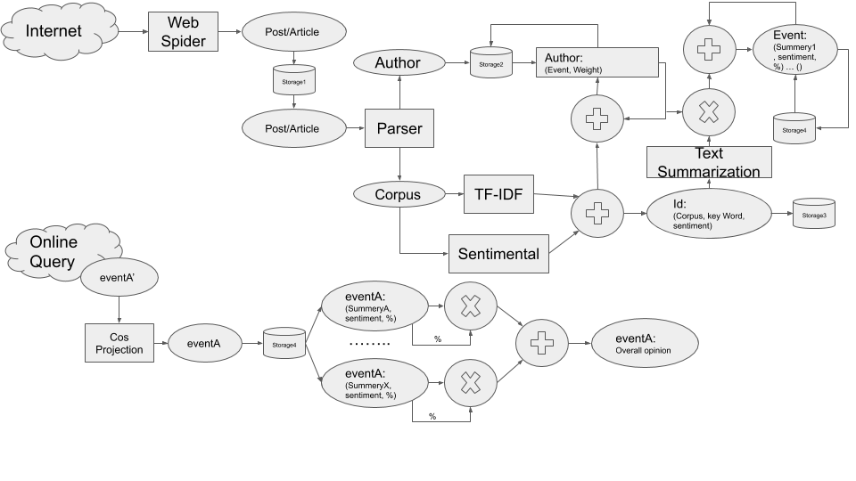

Software System for Gathering and Analyzing Online Opinions about Events
========================================================================

## Architecture

## Requirements
  conda install -c anaconda beautifulsoup4
  conda install -c anaconda nltk
    >>> import nltk
    >>> nltk.download('punkt')
    >>> nltk.download('stopwords')
  conda install -c anaconda lxml

## Repository File structure
  .
  ├── env_config
  ├── images
  │   └── opinion_search_engine_PSA_v.0.1.png
  ├── README.rst
  └── src
      └── Parser.py
